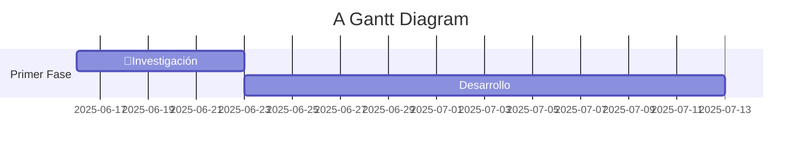

<<<<<<< HEAD
<p align="center"><a href="https://laravel.com" target="_blank"></a></p>

<p align="center">
<a href="https://github.com/laravel/framework/actions"></a>
<a href="https://packagist.org/packages/laravel/framework"></a>
<a href="https://packagist.org/packages/laravel/framework"></a>
<a href="https://packagist.org/packages/laravel/framework"></a>
</p>

## About Laravel

Laravel is a web application framework with expressive, elegant syntax. We believe development must be an enjoyable and creative experience to be truly fulfilling. Laravel takes the pain out of development by easing common tasks used in many web projects, such as:

- [Simple, fast routing engine](https://laravel.com/docs/routing).
- [Powerful dependency injection container](https://laravel.com/docs/container).
- Multiple back-ends for [session](https://laravel.com/docs/session) and [cache](https://laravel.com/docs/cache) storage.
- Expressive, intuitive [database ORM](https://laravel.com/docs/eloquent).
- Database agnostic [schema migrations](https://laravel.com/docs/migrations).
- [Robust background job processing](https://laravel.com/docs/queues).
- [Real-time event broadcasting](https://laravel.com/docs/broadcasting).

Laravel is accessible, powerful, and provides tools required for large, robust applications.

## Learning Laravel

Laravel has the most extensive and thorough [documentation](https://laravel.com/docs) and video tutorial library of all modern web application frameworks, making it a breeze to get started with the framework.

You may also try the [Laravel Bootcamp](https://bootcamp.laravel.com), where you will be guided through building a modern Laravel application from scratch.

If you don't feel like reading, [Laracasts](https://laracasts.com) can help. Laracasts contains thousands of video tutorials on a range of topics including Laravel, modern PHP, unit testing, and JavaScript. Boost your skills by digging into our comprehensive video library.

## Laravel Sponsors

We would like to extend our thanks to the following sponsors for funding Laravel development. If you are interested in becoming a sponsor, please visit the [Laravel Partners program](https://partners.laravel.com).

### Premium Partners

- **[Vehikl](https://vehikl.com)**
- **[Tighten Co.](https://tighten.co)**
- **[Kirschbaum Development Group](https://kirschbaumdevelopment.com)**
- **[64 Robots](https://64robots.com)**
- **[Curotec](https://www.curotec.com/services/technologies/laravel)**
- **[DevSquad](https://devsquad.com/hire-laravel-developers)**
- **[Redberry](https://redberry.international/laravel-development)**
- **[Active Logic](https://activelogic.com)**

## Contributing

Thank you for considering contributing to the Laravel framework! The contribution guide can be found in the [Laravel documentation](https://laravel.com/docs/contributions).

## Code of Conduct

In order to ensure that the Laravel community is welcoming to all, please review and abide by the [Code of Conduct](https://laravel.com/docs/contributions#code-of-conduct).

## Security Vulnerabilities

If you discover a security vulnerability within Laravel, please send an e-mail to Taylor Otwell via [taylor@laravel.com](mailto:taylor@laravel.com). All security vulnerabilities will be promptly addressed.

## License

The Laravel framework is open-sourced software licensed under the [MIT license](https://opensource.org/licenses/MIT).
=======
# (NOMBRE DE LA APP)
---
## Recursos:

**Videos para hacer un crud en PHP:** https://www.youtube.com/playlist?list=PL-6S8_azQ-MpM0BaKz0VPtnczB6MiOflq

---

## 🖥️ Configuración básica git
---
```shell
git config --global user.name "tu_nombre"
git config --global user.email "tu@email.com"
git config --global core.editor code
git config --global core.autocrlf true (si eres windows) input (si eres linux)
```
---
## 📥 Clonar el respositorio en tu equipo
---
### Para linux

**Crear SSH (esto solo se hace una vez)**

```shell
ssh-keygen -t ed25519 -C "tu_correo@example.com"
> Enter a file in which to save the key (/home/YOU/.ssh/id_ALGORITHM):[solo presionen enter y ya]
> Enter passphrase (empty for no passphrase): [Aquí escribes tu contraseña]
> Enter same passphrase again: [Aquí escribes tu contraseña]
```

```shell
$ eval "$(ssh-agent -s)"
> Agent pid 59566
ssh-add ~/.ssh/id_ed25519
```

**Ahora simplemente accedes desde root ejecutando este comando**

```shell
cd .shh
cat id_ed25519.pub
```

El resultado lo copias y lo agregas en la configuración SSH de tu perfil de github.com

**clonación de repositorio en linux si usas SSH**

```shell
git clone git@github.com:alfMG-bit/make_my_documentation.git
```

### Para windows

**clonación de repositorio en windows**

```shell
git clone https://github.com/alfMG-bit/make_my_documentation.git
```

---

## Ramas (Branches)
---
### 🔗 División de ramas

| Rama/Persona           | Alan Moreno | Alfredo | Alan Martinez | Alfonso | Job |
| ---------------------- | ----------- | ------- | ------------- | ------- | --- |
| **Base de Datos**      |             | ✅       |               | ✅       |     |
| **Tailwind/Views**     |             |         | ✅             |         | ✅   |
| **Models/Controllers** | ✅           |         |               |         |     |
| **main**               | ✅           | ✅       | ✅             | ✅       | ✅   |

### 👤 ¿Quién va a crear cada rama?

| 👤Encargado       | 🔗Rama             | 🏷️Nombre que debe de llevar |
| ----------------- | ------------------ | ---------------------------- |
| **Alfonso**       | Base de datos      | **database**                 |
| **Alan Martinez** | Views              | **views**                    |
| **Alan Grajeda**  | Models/Controllers | **models_controllers**       |

### 🔨 Crear su rama en git

```shell
cd make_my_documentation
git checkout -b "Nombre_de_tu_rama"
git add .
git commit -m "mensaje"
git push -u origin Nombre_de_tu_rama
```

---
# Instalación de MySQL

## Windows

Para windows, simplemente viajaran a la página oficial de *[MySQL](https://dev.mysql.com/downloads/windows/installer/8.0.html)* y descargaran el instalador de **357M**. **Para la instalación consulten a Alan**

## Linux

Para Linux, simplemente iran a *[MySQL repo](https://dev.mysql.com/downloads/repo/apt/)* y descargaran el paquete .deb

# Instalación de XAMPP (SOLO WINDOWS)

Para Xampp (un gestor de servidor local) necesitaran ir a https://www.apachefriends.org/es/index.html, descargan la versión de windows y ejecutan el instalador

**Para continuar con la instalación de Xampp, consulten a Alan**

# Instalación de PHP, Composer y Laravel
----
## Windows

Vas a ir a esta página e instalar composer https://getcomposer.org/

## Linux

```shell
/bin/bash -c "$(curl -fsSL https://php.new/install/linux/8.4)"
```

Estos comandos instalaran **automáticamente** las tres herramientas. Despues de instalar estas herramientas, **debes reiniciar tu terminal (cerrar la ventana)**.

### Instalar laravel por vía composer

```powershell
composer global require laravel/installer
```

---
# Pasos de desarrollo


>>>>>>> ca4994abe329265a01bf512148bbca6396007953
