# (NOMBRE DE LA APP)
---
## Recursos:

**Videos para hacer un crud en PHP:** https://www.youtube.com/playlist?list=PL-6S8_azQ-MpM0BaKz0VPtnczB6MiOflq

---

## 🖥️ Configuración básica git
---
```shell
git config --global user.name "tu_nombre"
git config --global user.email "tu@email.com"
git config --global core.editor code
git config --global core.autocrlf true (si eres windows) input (si eres linux)
```
---
## 📥 Clonar el respositorio en tu equipo
---
### Para linux

**Crear SSH (esto solo se hace una vez)**

```shell
ssh-keygen -t ed25519 -C "tu_correo@example.com"
> Enter a file in which to save the key (/home/YOU/.ssh/id_ALGORITHM):[solo presionen enter y ya]
> Enter passphrase (empty for no passphrase): [Aquí escribes tu contraseña]
> Enter same passphrase again: [Aquí escribes tu contraseña]
```

```shell
$ eval "$(ssh-agent -s)"
> Agent pid 59566
ssh-add ~/.ssh/id_ed25519
```

**Ahora simplemente accedes desde root ejecutando este comando**

```shell
cd .shh
cat id_ed25519.pub
```

El resultado lo copias y lo agregas en la configuración SSH de tu perfil de github.com

**clonación de repositorio en linux si usas SSH**

```shell
git clone git@github.com:alfMG-bit/make_my_documentation.git
```

### Para windows

**clonación de repositorio en windows**

```shell
git clone https://github.com/alfMG-bit/make_my_documentation.git
```

---

## Ramas (Branches)
---
### 🔗 División de ramas

| Rama/Persona           | Alan Moreno | Alfredo | Alan Martinez | Alfonso | Job |
| ---------------------- | ----------- | ------- | ------------- | ------- | --- |
| **Base de Datos**      |             | ✅       |               | ✅       |     |
| **Tailwind/Views**     |             |         | ✅             |         | ✅   |
| **Models/Controllers** | ✅           |         |               |         |     |
| **main**               | ✅           | ✅       | ✅             | ✅       | ✅   |

### 👤 ¿Quién va a crear cada rama?

| 👤Encargado       | 🔗Rama             | 🏷️Nombre que debe de llevar |
| ----------------- | ------------------ | ---------------------------- |
| **Alfonso**       | Base de datos      | **database**                 |
| **Alan Martinez** | Views              | **views**                    |
| **Alan Grajeda**  | Models/Controllers | **models_controllers**       |

### 🔨 Crear su rama en git

```shell
cd make_my_documentation
git checkout -b "Nombre_de_tu_rama"
git add .
git commit -m "mensaje"
git push -u origin Nombre_de_tu_rama
```

---
# Instalación de MySQL

## Windows

Para windows, simplemente viajaran a la página oficial de *[MySQL](https://dev.mysql.com/downloads/windows/installer/8.0.html)* y descargaran el instalador de **357M**. **Para la instalación consulten a Alan**

## Linux

Para Linux, simplemente iran a *[MySQL repo](https://dev.mysql.com/downloads/repo/apt/)* y descargaran el paquete .deb

# Instalación de XAMPP (SOLO WINDOWS)

Para Xampp (un gestor de servidor local) necesitaran ir a https://www.apachefriends.org/es/index.html, descargan la versión de windows y ejecutan el instalador

**Para continuar con la instalación de Xampp, consulten a Alan**

# Instalación de PHP, Composer y Laravel
----
## Windows

Vas a ir a esta página e instalar composer https://getcomposer.org/

## Linux

```shell
/bin/bash -c "$(curl -fsSL https://php.new/install/linux/8.4)"
```

Estos comandos instalaran **automáticamente** las tres herramientas. Despues de instalar estas herramientas, **debes reiniciar tu terminal (cerrar la ventana)**.

### Instalar laravel por vía composer

```powershell
composer global require laravel/installer
```

---
# Pasos de desarrollo


# Requierimientos técnicos
---

## Objetivo

Crear una aplicación de inteligencia artificial que ayude a los desarrolladores y equipos de scrum a desarrollar la documentación de un proyecto de manera rápida, eficiente y con diagramas.

## Alcance

El proyecto es una inteligencia artificial, un chat al cual se le pasarán archivos de código que este leerá. El chat permite que el usuario haga peticiones especializadas.

## Arquitectura del sistema

```mermaid
graph TB
	a("👤 Usuario")
	subgraph MVC
		b1("🖥️View")
		b2("⚙️Controller")
		b3("🔮Model")
	end
	c("💾 Data Base")

	a-->MVC
	b1-->b2-->b3-->c
```



## 💽 Base de Datos


# 🐘Para iniciar en Laravel
---
## Una vez clonado el repositorio

Cuando ya clonaste el repositorio del proyecto, tienes que hacer una serie de pasos para que este comience a funcionar de manera adecuada.

Cuando clonas un repositorio de un proyecto laravel, este por defecto trae un archivo .gitignore, en este archivo se ignoran todas las dependencias de composer y node.JS por cuestiones de almacenamiento, pues si se subiera todo ello, tardaría mucho y además sería muy pesado clonar

**Dentro del repositorio se deben ejecutar los siguiente comandos**

```shell
composer install
```

```shell
cp .env.example .env
```

```shell
php artisan key:generate
```

En el archivo ``.env`` copiaran el archivo ``.env.example`` y en la sección de base de datos pondrán esta porción de datos:

```shell
DB_CONNECTION=mysql
DB_HOST=127.0.0.1
DB_PORT=3306
DB_DATABASE=nombre_de_tu_bd
DB_USERNAME=tu_usuario
DB_PASSWORD=tu_contraseña
```

## Ubicación del proyecto

### 🪟 **En Windows**

Para hacer funcionar tu proyecto, clona el repositorio o mueve el ya clonado a la siguiente ruta:

```powershell
C:/Xampp/htdocs
```

### 🐧 **En Linux**

En linux bastara con correr el comando en la terminal, dentro de la ruta del proyecto ``php artisan serve``

```shell
cd proyecto_laravel
```

Este comando es para hacer las tablas en la **base de datos**.

```shell
php artisan migrate
```

Con este comando, instancias el servidor de **PHP**

```shell
php artisan serve
```

