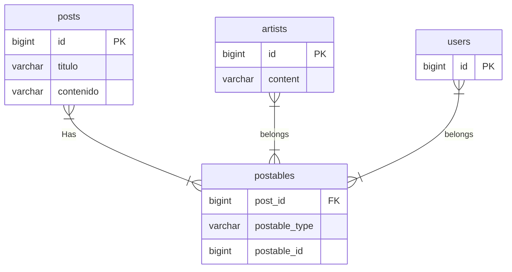

---
tags:
  - controllers
  - DataBases
  - Eloquent
  - models
  - "#Laravel"
date: 2025-06-16
---
# Contenido


## ¿Qué es?

Las relaciones muchos a muchos polimórficas, al igual que el resto son similares a las relaciones muchos a muchos comunes, con la diferencia de qué hay una entidad/tabla que trabaja con otras tablas diferentes entre sí.

En este caso, una **tabla principal** puede estar relacionada con **múltiples tablas hijas** de diferentes *tipos*

## Ejemplo



Para las relaciones [[🐘Relaciones (Muchos a Muchos)|muchos a muchos comunes]] lo que se hace es tener de por medio una tabla pivote. sin embargo, cuando se hacen (por ejemplo) 50 tablas que serán relaciones de muchos a muchos, no sería muy eficiente hacer 50 tablas pivote para solo asignarles un tag, por lo tanto, aquí entra en escena el polimorfismo en relaciones de muchos a muchos

### Tabla pivote

En este caso, las tablas ``artists`` y ``users`` tendrán ligadas los ``posts`` por medio de la **tabla intermedia** ``postable``

| **postables** |               |             |
| ------------- | ------------- | ----------- |
| **id**        | postable_type | postable_id |

---
## 🧪 Codificación

### Creación de la tabla pivote (postables)

La tabla que **conectará** las tablas entre sí, ``artists`` y ``users`` con ``posts`` a través de ``postables``

```php
<?php

use Illuminate\Database\Migrations\Migration;
use Illuminate\Database\Schema\Blueprint;
use Illuminate\Support\Facades\Schema;

return new class extends Migration
{
    /**
     * Run the migrations.
     */
    public function up(): void
    {
        Schema::create('postables', function (Blueprint $table) {
            $table->id();
            $table->morphs('postable');
            $table->foreignId('post_id')
                ->constrained()
                ->onDelete('cascade')
                ->onUpdate('cascade');
            $table->timestamps();
        });
    }

    /**
     * Reverse the migrations.
     */
    public function down(): void
    {
        Schema::dropIfExists('postables');
    }
};

```

### Modelos

En cada uno de los modelos, se agregara una función/método con el nombre de la tabla a la que se hará referencia.

**Modelo Artist y User**

```php
public function posts
{
	return $this->morphToMany(Post::class, "postable");
}
```

**Modelo Post**

```php
public function artists
{
	return $this->morphedByMany(Artist::class, "postable");
}
```

Si no se usarán las convenciones, se tendría que especificar en que tabla se guarda el campo ``postable``: **[[🐘Relaciones Polimórficas (Uno a Muchos)|referencia]]**.